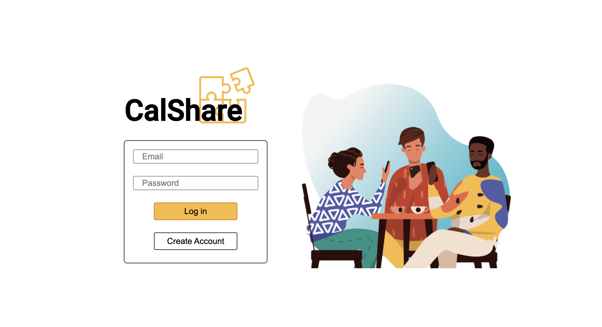
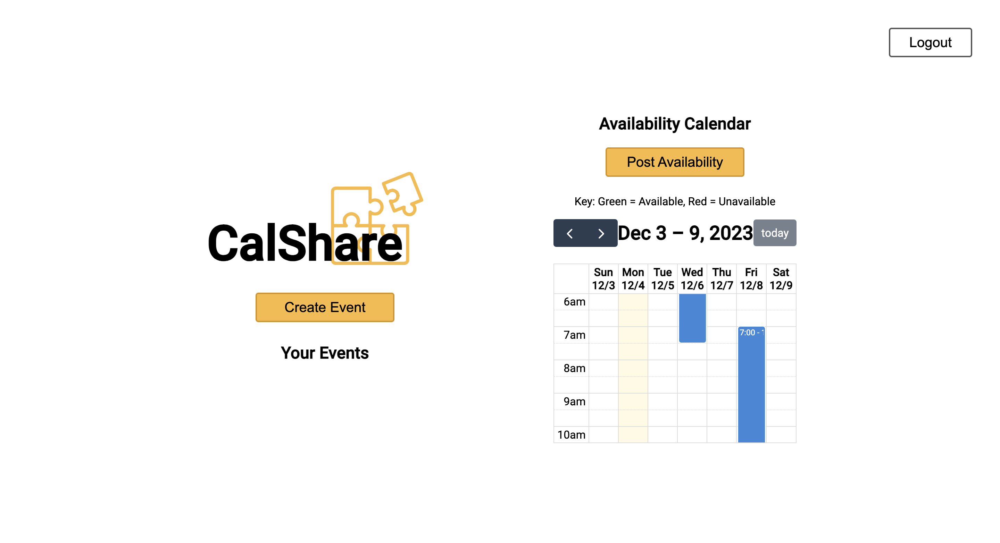
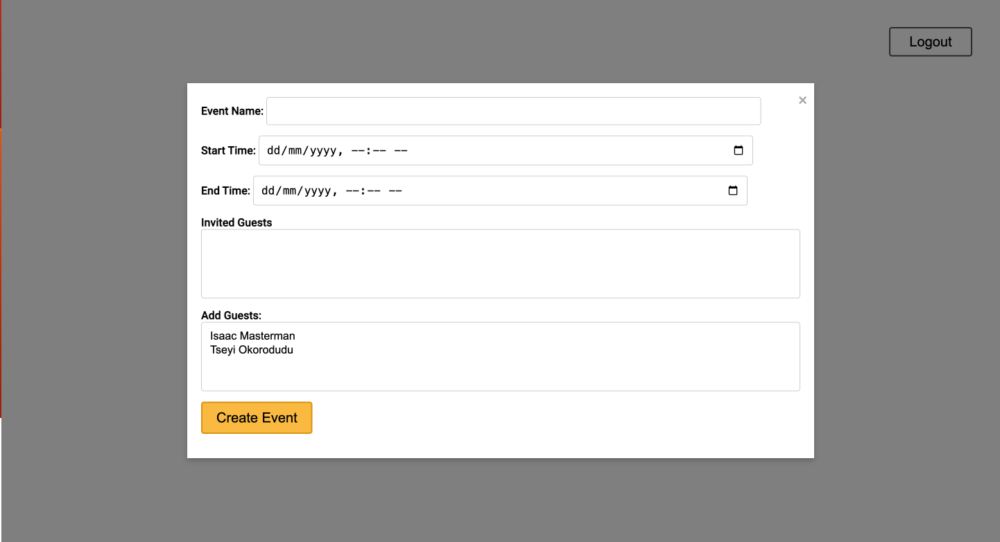
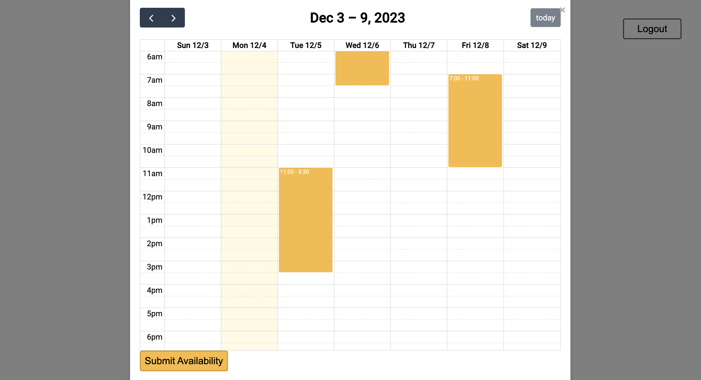

# CalShare

## Description
CalShare is an innovative scheduling platform designed to optimize the process of organizing meetings. This user-friendly application allows individuals to seamlessly integrate their schedules, highlighting mutually available time slots for efficient meeting planning. Whether it's for team meetings or casual get-togethers, CalShare provides an all-in-one solution for calendar management, event creation, and real-time availability tracking.

- **Motivation**: The inspiration behind CalShare stemmed from the common challenge of coordinating meetings amidst busy schedules. CalShare addresses this pain point by offering a centralized platform where users can easily synchronize their availability.
- **Problem Solved**: CalShare eliminates the time-consuming task of finding a suitable time slot for all participants, enhancing productivity for teams and individuals.
- **Learning Experience**: Developing CalShare offered insights into user interface design, calendar integration, and real-time data synchronization.

## Table of Contents
- [Installation](#installation)
- [Usage](#usage)
- [Screenshots](#screenshots)
- [Credits](#credits)
- [License](#license)

## Installation
To install CalShare, follow these steps:
1. Clone the repository from GitHub.
2. Install the necessary dependencies by running `npm install`.

## Usage
1. Sign up or log in to access your dashboard.
2. Create new events or view existing ones.
3. Invite team members and track their availability.
4. Schedule meetings efficiently based on mutual availability.

## Screenshots
- 
- 
- 
- 

## Credits
- **Developers**: Danyon Talbot, Isaac Masterman, Josh Nardella, and Emma Denton.
- **Inspiration**: Inspired by when2meet and integrated with FullCalendar.io.
- **Mentorship**: Thanks to Saurya Acharya, instructor at the EdEx coding bootcamp, for guidance and support.

## License
This project is licensed under the MIT License. For more information, please see the [LICENSE](LICENSE) file.
